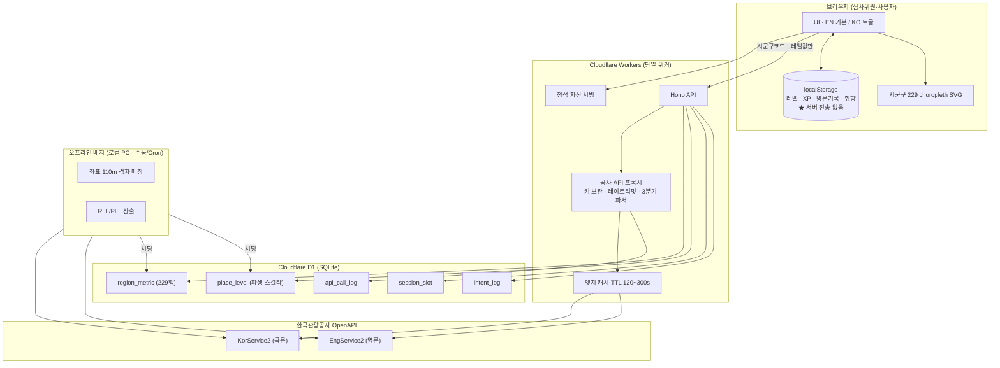

# TSD — 말길 (Malgil) 기술 명세서 v1.0

> v1.1 · 2026-09-03 개정 · 대상 릴리스 2026-09-17 (제출 9/19) · 상위: `PRD.md` / `말길_기획서_v0.7.md`
> **본 문서의 API 스펙은 2026-08-17 약 780콜 실호출로 전수 검증한 값입니다.** 문서 조사값이 아닙니다.
> ⚠️ 프론트엔드 스택은 **D-11 미결**(기획서 §9-1). 본 문서는 **웹 단독**을 전제로 작성했고, Flutter 유지 시 §3만 교체하면 나머지는 그대로 유효합니다.

---

## 1. 설계 원칙 — 이 5개가 나머지를 결정한다

| # | 원칙 | 나오는 결과 |
|---|---|---|
| **1** | **좌표는 내려오기만 하고 올라가지 않는다** | GPS 미사용 · `locationBasedList2` 미사용 · 위치 이력 서버 전송 0 |
| **2** | **화면에 뜨는 것은 전부 렌더 시점 실시간 호출** | 저장 대상 = 식별자와 스칼라뿐. title·주소·overview·이미지 URL·전화번호 **저장 금지** |
| **3** | **콜 수는 줄이되, 호출 이력은 늘린다** | 전수 덤프 금지 · 시군구 단위 페이지네이션 · Cron 일일 배치 |
| **4** | **외부 벤더 의존을 공사 API 하나로 축소** | 지도 SDK 없음 · 폰트 셀프호스팅 · 형태소 분석기 런타임 없음 |
| **5** | **실패해도 화면이 깨지지 않는다** | 3분기 파서 · 3단 폴백 · 한도 도달 시 정직한 배너 |

---

## 2. 시스템 아키텍처



**단일 워커 원칙** — 정적 자산과 API를 한 워커에 담는다. 배포 대상이 1개면 10/28 PT까지 무중단 유지가 실제로 가능하다.

---

## 3. 스택

### 3-1. 확정안 (Flutter 단일 코드베이스 · 웹 우선 출시)

> **확정 2026-09-07 (D-11 해소)** — 근거는 기획서 §1-4. 최종 전달 형태가 앱이므로 재작성을 피하기 위해 Flutter를 채택하고, 공모전 제출은 **Flutter Web 빌드**로 낸다. **프론트 층만 교체되고 백엔드 이하는 전부 유지된다.**

| 층 | 선택 | 근거 |
|---|---|---|
| 프론트 | **Flutter (Web 빌드)** — 로컬 **3.44.6 stable / Dart 3.12.2** | 단일 코드베이스에서 Web·Android 동시 산출. 2단계 앱 런치 시 재작성 0 |
| 상태 | `shared_preferences`(웹은 localStorage 백엔드) + 얇은 스토어 | 로그인 없음. 서버 상태 최소 |
| 스타일 | Flutter 테마 + 디자인 토큰 | 프레임워크 미도입 원칙은 그대로 |
| 지도 | **정적 SVG choropleth** (시군구 229) — `flutter_svg` 또는 `CustomPainter` | 외부 SDK 0. 로딩 실패 상태 자체가 없음 |
| 백엔드 | **Cloudflare Workers + Hono** | 슬립 없음. 콜드스타트 사실상 0 |
| DB | **Cloudflare D1** | 워커와 동일 플랫폼. 자동 일시정지 없음 |
| 폰트 | Pretendard 셀프호스팅 (subset) | 외부 CDN 의존 제거 |
| 배치 | 로컬 Python (Kiwi 포함) | Workers에서 형태소 분석 불가 |

**배제한 것과 이유**

| 배제 | 이유 |
|---|---|
| Vercel Hobby | **상업적 이용 금지 조항.** 공모전 수상 후 사업화 경로와 충돌 |
| Supabase 무료 | **7일 무활동 시 프로젝트 자동 일시정지.** 10/28 PT까지 무중단 요구 미충족 |
| 네이버/카카오 지도 | 무료 한도·대표계정·결제수단 등록 여부 전부 미확인. **첫 화면에 미검증 외부 의존을 두지 않는다** |
| Fly/Render 파이썬 서버 | 형태소 분석용으로 세우면 무중단 유지 대상이 1→2개 |

### 3-2. Flutter Web 적용 시 변경 범위

| 변경되는 것 | 유지되는 것 |
|---|---|
| 프론트 = **Flutter Web 빌드** | **§4~§10 전부** |
| choropleth = `flutter_svg` 또는 `CustomPainter` | **Workers 프록시 · D1 · PLL 산출식 · API 스펙** |
| 빌드 산출물(`build/web`)을 **Workers 정적 자산으로 서빙** | 위치 처리 원칙 · 저작권 처리 |

> ✅ **CORS · 키 노출 문제 없음.** 브라우저(Flutter Web)는 Workers 프록시만 호출하고 공사 API를 직접 부르지 않는다. 서비스키는 Workers에 남고, 동일 오리진 서빙이라 CORS 프리플라이트도 발생하지 않는다. **이 구조를 깨고 클라이언트에서 공사 API를 직접 호출하면 키가 그대로 노출된다 — 금지.**

#### 렌더러 — ⚠️ 선택지가 없다

**Flutter 3.44.6에는 `--web-renderer` 플래그가 존재하지 않는다.** HTML 렌더러는 3.29에서 제거됐다(`flutter build web --help` 실측 확인). 남은 선택지는 둘뿐:

| 방식 | 명령 | 비고 |
|---|---|---|
| **CanvasKit** (기본) | `flutter build web -O4` | 초기 번들에 CanvasKit 페이로드 포함 |
| skwasm (WebAssembly) | `flutter build web --wasm` | JS 폴백 있음. 브라우저 지원 편차 → **심사 환경에서 검증 전 채택 금지** |

→ 따라서 **첫 페인트 3초 요구는 렌더러 선택이 아니라 로딩 구간 설계로 지킨다.** 대응 4가지는 기획서 §8-3, 실측은 리스크 9-24.

**필수 조치 2건**

1. **`web/index.html`에 정적 로딩 셸** — 엔진 부팅 전에 순수 HTML/CSS로 스켈레톤을 즉시 페인트. 심사위원이 백지를 보는 구간을 0초로 만든다.
2. **CanvasKit 셀프호스팅** — `gstatic` CDN 대신 Workers 정적 자산으로 동일 오리진 서빙. §3-1의 "외부 CDN 의존 제거" 원칙과 일관.

---

## 4. 공사 OpenAPI — 실측 스펙

### 4-1. 엔드포인트

```
국문  https://apis.data.go.kr/B551011/KorService2/{operation}
영문  https://apis.data.go.kr/B551011/EngService2/{operation}
```

> ⛔ **구버전 `KorService1`·`KorService`는 폐기됨** — HTTP 400 `NO_OPENAPI_SERVICE_ERROR`. v1 기반 블로그 예제는 전부 무효다.

### 4-2. 오퍼레이션 15종 (실호출 `resultCode=0000` 확인)

| 분류 | 오퍼레이션 | 말길 사용 |
|---|---|---|
| 코드 | `areaCode2` | ❌ (legacy) |
| 코드 | **`ldongCode2`** | ✅ **F3 시군구 드롭다운 (런타임 호출)** |
| 코드 | `categoryCode2` / `lclsSystmCode2` | ⭕ 배치 |
| 목록 | **`areaBasedList2`** | ✅ **F4 목록 · 배치** |
| 목록 | `locationBasedList2` | ⛔ **금지** (§6) |
| 목록 | `searchKeyword2` | ⭕ 로컬 키워드 분석(배치) |
| 목록 | `searchFestival2` / `searchStay2` | ❌ |
| 상세 | **`detailCommon2`** | ✅ **F5 상세 · F1 진단 지문** |
| 상세 | **`detailIntro2`** | ✅ **F5 음식점 실무 필드** |
| 상세 | `detailInfo2` / `detailImage2` | ⭕ P2 |
| 동기화 | `areaBasedSyncList2` | ❌ |
| 특수 | `detailPetTour2` | ❌ (발전계획 근거로만 언급) |

> **기능설명서 4장에는 실제 코드에 들어간 것만 적는다.** 미사용 오퍼레이션 나열은 인증키 검증에서 즉시 불일치로 드러난다.

### 4-3. 공통 파라미터

| 파라미터 | 필수 | 실측 비고 |
|---|---|---|
| `serviceKey` | ✅ | 이 프로젝트 키는 **64자리 16진수** → 인코딩/디코딩 키 동일. 원본·이중인코딩본 둘 다 동작 |
| `MobileOS` | ✅ | **값 검증 없음** (`BOGUS`도 통과). 누락 시 `resultCode=11` |
| `MobileApp` | ✅ | 임의 문자열 |
| `_type` | ⚠️ | **생략 시 XML이 기본값.** `json` 명시 필수 |
| `numOfRows` | — | **★ 상한 없음.** `60000` 요청 시 전량 단일 응답 (8/17 실측 48,858건) |
| `pageNo` | — | 마지막 페이지 초과 시 **에러가 아니라 빈 `items`** + `resultCode=0000` |

### 4-4. ⚠️ 에러 응답 3형태 — 파서가 조용히 깨지는 지점

**정상 응답만 `response` 래퍼가 있다. 에러는 래퍼 없이 온다.**

```jsonc
// ① 정상 — HTTP 200
{ "response": { "header": { "resultCode": "0000", ... },
                "body": { "items": { "item": [...] }, "totalCount": 48858, ... } } }

// ② 파라미터 오류 — HTTP 200 (!) + 평면 JSON, response 래퍼 없음
{ "responseTime": "...", "resultCode": "11",
  "resultMsg": "NO_MANDATORY_REQUEST_PARAMETERS_ERROR1(MobileOS)" }
// resultCode=10 → INVALID_REQUEST_PARAMETER_ERROR(foo)

// ③ 인증키 오류 — HTTP 403 / 401 / 400 + XML 또는 평면 JSON
// 403 SERVICE_KEY_IS_NOT_REGISTERED_ERROR (returnReasonCode=30) — 미신청 서비스
// 401 SERVICE_KEY_IS_NULL              (returnReasonCode=20)
// 400 NO_OPENAPI_SERVICE_ERROR                                  — 폐기된 서비스
```

```ts
// 필수 파서 — 이 3분기를 안 타면 에러가 정상 응답처럼 통과한다
export function parseKto(status: number, raw: unknown): KtoResult {
  if (status === 403) return { ok: false, kind: 'key_not_registered' };
  if (status === 401) return { ok: false, kind: 'key_null' };
  if (status === 400) return { ok: false, kind: 'service_gone' };

  const j = raw as any;
  // ★ HTTP 200이어도 response 래퍼가 없으면 에러다
  if (j?.response == null) {
    return { ok: false, kind: 'param_error', code: j?.resultCode, msg: j?.resultMsg };
  }
  const code = j.response?.header?.resultCode;
  if (code !== '0000') return { ok: false, kind: 'api_error', code };

  const body = j.response.body;
  // items가 빈 문자열로 오는 케이스 방어
  const item = body?.items?.item;
  const list = Array.isArray(item) ? item : item ? [item] : [];
  return { ok: true, list, totalCount: Number(body?.totalCount ?? 0) };
}
```

### 4-5. 지역 코드 — ⚠️ `areacode`를 쓰면 안 된다

| 필드 | 국문 충전율 | 영문 충전율 |
|---|---|---|
| `areacode` (legacy) | **44.6%** | **21.3%** |
| **`lDongRegnCd` + `lDongSignguCd`** | **100%** | **99.99%** |

실측 대비: 서울 조회 시 `areaCode=1` → **2,170건** vs `lDongRegnCd=11` → **8,014건 (3.7배)**.

> 이것이 `memory.md` `[F-01]`의 *"영문 75% 지역 미태깅"* 판정의 **진짜 원인**이다. `lDong`으로 바꾸면 지역 서사가 복구된다.

```
지역 키 = lDongRegnCd(2) + lDongSignguCd(3) = 행정표준코드 5자리
  예) 안동시 47170 · 정선군 51770 · 평창군 51760 · 서울 종로구 11110
```

**⚠️ 전남광주통합특별시** — `ldongCode2`는 시도 **16개**를 반환하며 `12 = 전남광주통합특별시`(기존 46 전남·29 광주 부재). 반면 `areaCode2`는 여전히 광주(5)·전남(38)을 분리 유지한다. **두 체계가 공존한다.**
→ 시군구 드롭다운 옵션을 **`ldongCode2` 런타임 호출로 생성**하면 코드 하드코딩이 사라져 이 문제가 자동 해소되고, 동시에 기능설명서 4장에 실사용 오퍼레이션이 하나 늘어난다.

### 4-6. ⚠️ contentTypeId — 국문과 영문의 코드 공간이 다르다

**`memory.md` `[F-01]`의 "영문 유형 필터 미작동"은 오진이었다.** 국문 코드를 영문에 넘겨서 0이 나온 것이다.

| 유형 | 국문 | 국문 건수 | 영문 | 영문 건수 | 커버율 |
|---|---:|---:|---:|---:|---:|
| **음식점** | **39** | 13,497 | **82** | **463** | **3.43%** |
| 관광지 | 12 | 12,639 | 76 | 2,609 | 20.64% |
| 쇼핑 | 38 | 12,238 | 79 | 11,071 | 90.46% |
| 레포츠 | 28 | 3,809 | 75 | 216 | 5.67% |
| 숙박 | 32 | 2,968 | 80 | 178 | 6.00% |
| 문화시설 | 14 | 2,728 | 78 | 464 | 17.01% |
| 축제공연행사 | 15 | 920 | 85 | 240 | 26.09% |
| 여행코스 | 25 | 59 | — | 0 | 0% |
| **합계** | | **49,782** | | **15,286** | 30.71% |
| **쇼핑 제외** | | **37,547** | | **4,214** | **11.22%** |

> 영문 쇼핑 11,072건 중 **10,932건(98.7%)이 `[Tax Refund Shop]`** 사후면세점이며 **그중 70%가 수도권**에 있다.
>
> ⛔ **모든 커버리지 산출에서 쇼핑(국문38/영문79)을 제외한다.** 제외하지 않으면 지표가 관광 콘텐츠 격차가 아니라 **면세점 유통 통계**를 재게 되고, 인구감소지역 89곳 논거가 무너진다(기획서 `[F-07]`).
>
> ⚠️ **카탈로그는 살아 움직인다.** 영문 음식점 307건(8/17) → 463건(9/3), **17일 만에 +51%**. 제출 직전 재실측 필수.
>
> *(위 표는 2026-09-03 실측)*

### 4-7. 기타 실측 주의사항

| 항목 | 실측 |
|---|---|
| `modifiedtime` | **"이후"가 아니라 정확일자 일치 필터.** `20260810` → 62건(전부 그날), `20260101` → 0건 |
| `detailCommon2` | **`defaultYN`/`overviewYN`/`firstImageYN` 등 YN 계열 파라미터 전부 거부**(`resultCode=10`). `contentTypeId`도 거부. **`contentId` 단독**으로 28필드 반환 |
| `detailIntro2` (39) | 18필드: `firstmenu` `treatmenu` `opentimefood` `restdatefood` `chkcreditcardfood` `reservationfood` `infocenterfood` `parkingfood` `lcnsno` 등. **외국어 안내 필드는 존재하지 않음** |
| `tel` | 목록 응답(`areaBasedList2`)에서 **국문 음식점 13,497건 전량 0건**. 전화번호는 `detailIntro2.infocenterfood`에만 |
| `lclsSystm1/2/3` | **목록 응답에 100% 포함** → 상세 조회 없이 세분류 가능. 1단: AC 숙박 · C01 추천코스 · EV 축제 · EX 체험 · FD 음식 · HS 역사 · LS 레저 · NA 자연 · SH 쇼핑 · VE 문화 |
| `cat1/2/3` | 44.8%만 충전 → **사용하지 않음** |
| 좌표 `mapx`/`mapy` | 영문 99.9%(15,072/15,085), 국문 음식점 100%(13,496/13,497) |
| `cpyrhtDivCd` | **Type3 70.3%**(34,325 · 변경금지) / Type1 15.8%(7,709) / 빈값 14.0%(6,824 = `firstimage` 없는 레코드와 정확히 일치) |
| 트래픽 | 개발계정 **1,000/일 자동승인** · 운영계정 **10만/일 심의승인**(통상 2~3일) |
| 카탈로그 변동 | 국문 50,670(7/18) → 48,858(8/17) → **49,782(9/3)**, 영문 15,640 → 15,085 → **15,286**. 영문 음식점은 307 → **463(+51%)**. **단조 감소가 아니라 진동한다.** 모든 수치에 산출일 병기 + 제출 직전 재실측 |

---

## 5. 데이터 모델 (D1 / SQLite)

> **원칙 2 적용** — 표시 가능한 콘텐츠를 단 하나도 저장하지 않는다. 좌표 격자키도 저장하지 않는다(공사 원본 구조 복제로 읽힐 위험).

```sql
-- 지역 지표 (229행) — 서비스의 주력. 이것만으로도 F3·F4가 성립한다
CREATE TABLE region_metric (
  sgg_code      TEXT PRIMARY KEY,   -- lDongRegnCd+lDongSignguCd 5자리
  sgg_name      TEXT NOT NULL,
  kor_food_cnt  INTEGER NOT NULL,
  eng_food_cnt  INTEGER NOT NULL,
  kor_all_cnt   INTEGER NOT NULL,
  eng_all_cnt   INTEGER NOT NULL,
  taxfree_cnt   INTEGER NOT NULL,   -- 사후면세점 밀도 = 외국인 응대 경험 대리지표
  rll           INTEGER NOT NULL,   -- 1~5 (절대 임계값)
  is_depop      INTEGER NOT NULL DEFAULT 0,  -- 인구감소지역 89곳
  computed_at   TEXT NOT NULL
);

-- 장소 파생 지표 — 로컬 후보만. 표시 정보 없음
CREATE TABLE place_level (
  content_id    TEXT PRIMARY KEY,
  sgg_code      TEXT NOT NULL,
  pll           INTEGER NOT NULL,   -- 1~5
  en_covered    INTEGER NOT NULL,   -- 110m 격자 매칭 결과 0/1
  computed_at   TEXT NOT NULL
);
-- ⛔ 저장 금지: title, addr1/2, overview, firstimage, tel, mapx, mapy, grid_x, grid_y

-- 진단 문항 (8문항)
CREATE TABLE quiz_item (
  id            INTEGER PRIMARY KEY,
  level         INTEGER NOT NULL,   -- 1~5
  passage_ko    TEXT,               -- NULL이면 overview 실시간 인용
  src_content_id TEXT,              -- 실시간 인용 시 사용
  question_en   TEXT NOT NULL,
  choices_json  TEXT NOT NULL,
  answer_idx    INTEGER NOT NULL,
  grammar_ref   TEXT                -- 국립국어원 2017 문법 등급 근거
);

-- 세션 (정규화하지 않는다 — 호스트 3~5명 규모에서 정규화는 낭비)
CREATE TABLE session_slot (
  id              INTEGER PRIMARY KEY,
  program_code    TEXT NOT NULL,        -- 'S1' | 'S2'
  title_en        TEXT NOT NULL,
  host_alias      TEXT NOT NULL,        -- 실명 저장 안 함
  band_min_level  INTEGER NOT NULL,     -- 사전 슬롯 속성
  band_max_level  INTEGER NOT NULL,
  meet_content_id TEXT NOT NULL,        -- 공사 등재 '앵커'만 (시장·역·공원)
  sgg_code        TEXT NOT NULL,
  starts_at       TEXT NOT NULL,
  capacity_max    INTEGER NOT NULL DEFAULT 5,
  status          TEXT NOT NULL         -- 'open'|'closed'|'done'|'recruiting'
                                        -- ★ recruiting = 말벗 미확보 지역에 정직하게 표시.
                                        --   실재하지 않는 슬롯 게시는 허위 기재(G14) 직행.
);
-- ⛔ 컬럼 금지: price_krw, seats_left, diet_note, host_real_name, host_phone

-- 관심 등록 (신청 아님 — 청약 접수로 읽히지 않게)
CREATE TABLE intent_log (
  id          INTEGER PRIMARY KEY,
  slot_id     INTEGER NOT NULL,
  email       TEXT NOT NULL,
  display_name TEXT,
  level       INTEGER NOT NULL,
  created_at  TEXT NOT NULL
);

-- 호출 증빙 (F9)
CREATE TABLE api_call_log (
  id          INTEGER PRIMARY KEY,
  operation   TEXT NOT NULL,
  service     TEXT NOT NULL,      -- 'kor' | 'eng'
  status      TEXT NOT NULL,
  called_at   TEXT NOT NULL
);
```

**클라이언트 저장 (localStorage 단독 — 서버 동기화 없음)**

```jsonc
{ "level": 3, "levelSource": "quiz",      // "quiz" | "topik" | "manual"
  "topics": ["FD","HS"],                   // lclsSystm1 대분류
  "visited": ["126508","232229"],          // 자기신고
  "phrasesUsed": ["126508:이거 얼마예요"],
  "stayDays": { "51770": ["2026-09-05"] }, // 자기신고 날짜만
  "uiLang": "en" }
```

---

## 6. 위치 처리 — 게이트 대응

### 6-1. 무엇이 금지인가

⚠️ **v0.5 이전 설계의 오독 교정.** 위치정보법 제2조제1호는 위치정보를 *"개인이 특정한 시간에 존재하거나 존재하였던 장소에 관한 정보"*로 정의하지 **좌표로 정의하지 않는다.** *"contentid=232229에서 2026-09-13 11:30 인증 성공"*은 위경도보다 **더 정밀한** 위치 특정 정보다.

| 서버 전송 ✅ | 서버 전송 ⛔ |
|---|---|
| 시군구 코드 (드롭다운 선택 = 측정값 아님) | 좌표 (`navigator.geolocation` 자체를 호출하지 않음) |
| 레벨 값 1개 | 방문 인증 `{장소ID, 성공, 시각}` |
| 세션 관심 등록 시 이메일 | 체류 기록 · 세션 종료 코드 · XP 이력 |

### 6-2. 봉인 장치

```
① navigator.geolocation 호출 금지 — ESLint no-restricted-globals
② locationBasedList2 래퍼 금지 — 코드 리뷰 체크리스트 1번
③ 서버 라우트는 body 스키마를 화이트리스트로 검증 (zod) — 정의되지 않은 키는 거부
④ 제출 전 grep: geolocation | mapX | mapY | locationBasedList
```

> **금지 대상은 오퍼레이션이 아니라 입력값이다.** 고정 좌표(집합장소 `contentid`의 좌표, 시군구 중심점)를 넘기는 반경 조회는 개인위치정보가 아니므로 법적으로 문제가 없다. 다만 리뷰 비용을 0으로 만들기 위해 5주 범위에서는 **오퍼레이션 자체를 쓰지 않는다.** 세션 전후 동선이 필요하면 집합장소의 `sgg_code`로 `areaBasedList2`를 1콜 호출하고 **거리 계산은 단말에서** 한다.

---

## 7. 지표 산출

### 7-1. RLL — 지역 언어 레벨 (사전 계산, 229행)

```
EnRatio(s)   = eng_food_cnt(s) / max(kor_food_cnt(s), 1)
TaxDensity(s)= taxfree_cnt(s)  / max(kor_all_cnt(s), 1)
Resource(s)  = log10(kor_all_cnt(s) + 1)          -- 역인과 통제 공변량

Need(s) = 0.55·(1 − norm(EnRatio))
        + 0.30·(1 − norm(TaxDensity))
        + 0.15·norm(Resource)        -- 자원이 많은데도 커버가 없으면 가중

RLL(s)  = 절대 임계값 구간화(Need)   -- ⛔ 분위수 절단 금지
```

**⚠️ 임계값은 캘리브레이션으로 정한다 (기획서 §9-5).** 검증셋 40곳을 팀 3인이 독립적으로 *"이 정도 한국어면 혼자 이용 가능"*을 TOPIK 급수로 라벨링 → 다수결 → Need에 대한 단조 회귀로 경계 산출 → **절대값 고정**. 카탈로그가 변해도 경계는 안 움직이고 각 레벨의 장소 수가 변한다.

> **왜 분위수를 버리는가.** 분위수로 자르면 *"Lv3인 사람이 갈 수 있는 비율"*이 항상 우리가 자른 40%가 된다. 사용자에 대한 정보가 0인 동어반복이고, 화면에서 가장 큰 숫자가 데이터에서 나오지 않는다.

**표시 문구 고정** — "언어 난이도"가 아니라 **"다국어 정보 커버리지"**. 각주 상시 노출:
> *"현장 외국어 응대 여부가 아니라, 공사 다국어 관광정보 등재 여부로 추정한 값입니다."*

### 7-2. PLL — 장소 언어 레벨 (상세 진입 시 실시간)

```
M = 영문 카탈로그 좌표 매칭 (110m 격자)         0/1   가중 0.45
D = 반경 1km 영문 등재 밀도 (사전 계산분 조회)   0~1   가중 0.25
C = lclsSystm 유형 정규화 커버율                0~1   가중 0.15
X = detailIntro2 실무 필드 (실시간)             0~1   가중 0.15
    · chkcreditcardfood 없음 +  · reservationfood 한국어 전용 +
    · opentimefood 형식 비정형 +

PLL = 절대 임계값 구간화(0.45M̄ + 0.25D̄ + 0.15C̄ + 0.15X̄)
```

**다국어 7종 미승인이 기본안이다.** `Jpn/Chs/Cht/Ger/Fre/Spn/Rus`는 실존하나 미신청(HTTP 403). 신청하되 **승인 없이 동작하는 위 가중치를 기본값으로 코딩**하고, 승인되면 M을 0~8 다치로 바꾸고 상수만 교체한다. **9월 첫 주까지 미승인이면 산출식과 기능설명서에서 전부 삭제한다** — 실제 호출 이력이 없는 API를 나열하는 것이 가장 확실한 감점 경로다.

**⛔ 레벨 배지는 상세 화면에만.** 목록·지도 카드에는 붙이지 않는다. 목록에서 배지를 붙이면 근거가 `D` 하나로 축소되어 *"이건 왜 Lv5입니까"*에 답할 수 없다.

### 7-3. 로컬 후보 추출 (배치)

```
로컬 후보 = 국문 음식점(39)
          ∧ 영문 미커버 (110m 격자)
          ∧ 로컬 어휘 사전 R 매치
```

⛔ **`firstimage` 없음을 조건에 넣지 않는다.** *"사진이 없다"*를 로컬성 신호로 쓰면 *"볼 것이 없다"*를 추천 조건으로 명문화하는 것이고, 상 트랙 카드 100%가 이미지 없음이 되어 완성도에 직격한다.

**로컬 어휘 사전 R** (영문 커버율 실측 — 기저율 30.88%의 1/6~1/25):

| 키워드 | 국문 히트 | 영문 커버율 |
|---|---:|---:|
| 5일장 · 분식 · 수제비 · 보리밥 | 13 · 31 · — · 50 | **0%** |
| 해장국 | 85 | 1.2% |
| 칼국수 | 255 | 1.2% |
| 순대 | 121 | 1.7% |
| 기사식당 | 20 | 5.0% |
| 국밥 · 막국수 · 백반 · 전통시장 | 101 · 178 · 12 · 73 | 저커버 |

> **전제 교정** — 기사식당·해장국·5일장은 **공사 API에 이미 있다.** 없는 게 아니라 **한국어로만 있다.** 이게 말길의 출발점이다.

### 7-4. 어휘 난이도 — 런타임 제거

**국립국어원 「2017 국제통용 한국어 표준교육과정 적용연구(4단계)」** 어휘 10,635개(1급 735 / 2급 1,100 / 3급 1,655 / 4급 2,200 / 5급 2,365 / 6급 2,580) + 문법 336개. **KOGL 제1유형** (출처표시 시 상업이용·변형 자유). TOPIK 1~6급과 1:1이라 별도 매핑 불필요.

| 용도 | 처리 |
|---|---|
| **진단 문항 난이도 통제** | ✅ **사람이 문항 쓸 때 보는 참조표.** 런타임 코드 불필요 |
| 장소 overview 자동 난이도 | ⛔ **5주 범위 밖.** Kiwi 모델이 104MB이고 Workers(V8 isolate, CPU 10ms)에서 실행 불가 |

> 2003년 「한국어 학습용 어휘 목록」(A/B/C 3등급)은 **단독 사용 불가** — 온천·사찰·한옥·민박·환전·매표소·입장료·국밥·갯벌이 전부 미수록이다. 2017 목록으로 바꾸면 동일 30단어 프로브에서 20개가 등급을 얻는다.
>
> **파싱 주의**: 어휘 컬럼이 `있다01/있다02`(슬래시), `긍정적01∙긍정적02`(가운뎃점) 형식을 혼용한다. `[/∙·,]`로 분할하고 말미 숫자를 제거하지 않으면 '있다'·'직접' 같은 최빈 기초어가 미수록으로 잘못 잡힌다(이 버그로 OOV율이 16.7%→27.8%로 부풀려짐). 정규화 후 고유 표제어 10,077개.
>
> 국립국어원 자료실은 표면 링크로는 HTML만 반환한다. 실제 파일은 `/common/download.do?file_path=…&c_file_name=<UUID>`에 Referer를 붙여야 받아지고 **UUID가 갱신되면 바뀌므로 파일을 리포지토리에 동봉**한다.

---

## 8. API 호출 전략

### 8-1. 화면당 콜 예산

| 화면 | 콜 |
|---|---|
| 랜딩 | 0 |
| 진단 8문항 | 0~2 (상위 2문항 `detailCommon2` 실시간 지문) |
| 시군구 드롭다운 | 1 (`ldongCode2`, 캐시 1h) |
| choropleth | 0 (D1 조회) |
| 목록 | **1** (`areaBasedList2` — `numOfRows` 상한 없어 종로구 844건도 1콜) |
| 상세 | 1~2 (`detailCommon2` + 음식점이면 `detailIntro2`) |
| 세션 카드 | 1 (앵커 `detailCommon2`) |

**심사위원 1명 5분 체험 = 8~12콜.** 개발계정 1,000/일로 하루 **70~100명** 감당.

### 8-2. 이력 확보 (게이트 G3)

| 조치 | 내용 |
|---|---|
| **셸 조기 배포** | 🔥 **9/5까지** 랜딩+시군구+목록만 있는 셸을 공개 URL에. **매일 호출이 찍히게** (현재 개발기간 호출 이력이 8/17 780콜뿐) |
| **전수 덤프 금지** | `numOfRows=60000` 1콜은 최적화가 아니라 **로컬 DB 적재 패턴으로 읽힌다.** 시군구 단위 페이지네이션(229콜)으로 — 콜 수가 늘어나는 것이 여기서는 이득 |
| **Cron 일일 배치** | 매일 정해진 시각. 개발기간 전 구간에 균등한 로그 |
| **개발계정 주력** | 운영계정은 심의승인이라 9월에 받으면 이력이 2~3주뿐. 8월 셋째 주부터 쌓는 것이 더 강한 방어 |
| **서면 질의** | `tourapi@knto.or.kr`에 *"파생 지표만 저장하고 원본은 전량 실시간 호출하는 구조가 별도 신청서 대상인지"* → **회신 보관** |

### 8-3. 3단 폴백

```
1단  실시간 호출 성공          → 정상 렌더
2단  엣지 캐시 (TTL 120~300s)  → "몇 분 전 데이터" 표시
3단  일일 한도 도달            → 배너 + 최소 fixture
     "일일 API 호출 한도 도달 — 내일 다시 실시간으로 표시됩니다"
```

> 3단 배너를 **"실시간 데이터 연결 실패"로 쓰지 않는다.** 한도 때문이라는 것은 부끄러운 사실이 아니라 실제로 실시간 호출을 하고 있다는 증거다.

### 8-4. 키 관리

- 인증키는 **Workers Secret**에만. 클라이언트 번들·리포지토리에 절대 노출 금지
- 클라이언트는 자체 `/api/*`만 호출. 공사 도메인 직접 호출 없음 (CORS 리스크 회피)
- 제출용 인증키 = **개발계정 키**. 운영계정은 신청하되 크리티컬 패스에서 제외

---

## 9. 저작권·표기

```tsx
// 공사 이미지 렌더 컴포넌트는 앱 전체에 단 하나만 존재한다
export function KtoImage({ src, cpyrhtDivCd, alt }: Props) {
  const modifiable = cpyrhtDivCd === 'Type1';   // 공공누리 제1유형만 변형 허용
  if (!src) return <MenuTextHero />;             // 이미지 없으면 메뉴 텍스트 히어로
  return (
    <figure>
      {/* Type3(70.3%)는 변경금지 → 크롭 금지, letterbox 강제 */}
      
      <figcaption>출처: ⓒ한국관광공사</figcaption>
    </figure>
  );
}
```

| 규칙 | 내용 |
|---|---|
| ⛔ 금지 | `object-fit: cover`(Type1 외) · `background-image`로 공사 이미지 · CI/BI 로고 이미지 |
| ✅ 필수 | `출처: ⓒ한국관광공사` 텍스트 — **컴포넌트 레벨에서 자동 부착**해 누락을 구조적으로 불가능하게 |
| ⛔ 사용자 노출 문자열 금지어 | `TourAPI` · `KTO` · `Korea Tourism Organization` — 제출 전 i18n JSON·페이지 타이틀·메타태그 **전수 grep** |
| 제출 이미지 6장 | **전부 서비스 UI 스크린샷.** 공사 사진 미사용 |

내부 코드 식별자(`ktoFetch`, `KTO_KEY`)는 무방하다.

---

## 10. 배치 파이프라인 (로컬 PC)

```
1. 국문 수집   시군구 229 × areaBasedList2 (contentTypeId=39 및 전체)
2. 영문 수집   시군구 229 × areaBasedList2 (contentTypeId=82 및 전체)
3. 좌표 매칭   110m 격자 (mapx/mapy → floor(x*1000)/floor(y*1000) 근사)
               → 국문 음식점 13,496곳 중 영문 대응 355곳, 미커버 13,141곳(97.37%)
4. 사후면세점  영문 쇼핑(79) 중 title에 '[Tax Refund Shop]' 포함 카운트
5. RLL 산출    §7-1 · 절대 임계값
6. 로컬 후보   §7-3
7. D1 시딩     region_metric / place_level 만
```

**호출 비용** — 시군구 스윕 약 458콜(국문+영문). 개발계정 1,000/일의 46%. 하루 1회 실행 가능.

---

## 11. 테스트

### 11-1. 골든 패스 (9/15 프리즈 판정 기준)

```
랜딩 → 진단 8문항 → 레벨 카드 → 시군구 선택 → choropleth
     → 목록 → 상세(실시간 PLL) → 동네 말벗 핀 → 관심 등록
```
**로그인 없이 3분 이내, 콘솔 에러 0.** 9/15에 실기 확인 후 커밋을 태그로 고정. 이후 변경은 그 태그에서 브랜치 → 머지 전 재통과.

### 11-2. 필수 회귀 케이스

| # | 케이스 | 기대 |
|---|---|---|
| 1 | 공사 API가 HTTP 200 + 평면 JSON 에러 반환 | 크래시 없이 폴백 |
| 2 | `pageNo` 초과 (빈 `items`) | 빈 목록 정상 표시 |
| 3 | **광주·전남·세종 시군구 선택** | 빈 목록이 아니어야 함 (`lDong` 통일 확인) |
| 4 | `firstimage` 없는 장소 | 메뉴 텍스트 히어로로 대체 |
| 5 | `cpyrhtDivCd = Type3` | `contain` 렌더 (크롭 없음) |
| 6 | 일일 한도 도달 | 정직한 배너 + fixture |
| 7 | localStorage 비활성 브라우저 | 메모리 폴백, 진단은 동작 |
| 8 | Lv2 사용자가 Lv4 세션 카드 진입 | 신청 버튼 **실제로 막힘** + 사유 표시 |
| 9 | `?demo=1` | Lv3 프리셋으로 즉시 지도 진입 |

### 11-3. 제출 전 체크

- [ ] `grep -riE 'geolocation|mapX|mapY|locationBasedList'` → 0건
- [ ] `grep -riE 'TourAPI|KTO|Korea Tourism'` (사용자 노출 문자열) → 0건
- [ ] `grep -riE 'Lv0|Lv6|한국의 [0-9]+%'` → 0건
- [ ] 기능설명서 4장의 오퍼레이션 목록 = 실제 코드의 호출 목록 (수기 대조)
- [ ] 해시태그 5개 = 기능 8개 = 흐름도 5개 정합
- [ ] 세션 화면에 가격·좌석수·알레르기 입력 없음
- [ ] **브랜드명 grep** — 특정 사업명·재단명·호스트 실명이 화면 문자열·문서에 0건
- [ ] 커버리지 산출 코드에서 **쇼핑(38/79) 제외**가 적용되어 있음

---

## 12. 기술 리스크

| 리스크 | 영향 | 대응 |
|---|---|---|
| **D-11 미결 (Flutter vs 웹)** | 착수 지연 | **9/4까지 결정.** 그 전에는 배치 파이프라인만 진행(스택 무관) |
| PLL 캘리브레이션(9-5) 미완 | 진단·필터 확정 불가 | **W1 최우선.** 끝나기 전엔 화면 확정 안 함 |
| 다국어 7종 미승인 | M 해상도 1비트 | **폴백이 기본안.** 9월 첫 주 미승인 시 산출식·문서에서 삭제 |
| 카탈로그 변동 (월 -3.5%) | 수치 불일치 | 모든 수치에 산출일 병기. 배치 재실행으로 갱신 |
| 이태원·망원 과대평가 | 지표 신뢰 | **기능설명서에 먼저 밝힌다.** 감추면 발각 시 신뢰를 잃고, 밝히면 한계를 아는 팀이 된다 |
| 개발 전담 인력 미지정 (9-8) | 일정 전면 붕괴 | 오프라인 세션 실행(5~7일)와 W2~W3 충돌. **9/4까지 분리 확정** |
| 9/15 프리즈 실패 | 안정화 기간 소멸 | **9/17을 최종 배포일로 잡고 9/18~9/21 배포 금지. 제출은 9/19.** |

---

**TSD v1.0 종료.** §4 API 스펙은 2026-08-17 실측이며, 카탈로그 수치는 월 단위로 변동하므로 배치 재실행 시 갱신할 것.
